# MoveGameplays

Aplicação automatizada para identificar input de um HD externo no windows, verificar se o HD conectado é o mesmo que foi configurado na aplicação, mover todas as fotos e as gameplays para o computador (com opções de mover a última gameplay ou as últimas 10) e deletar os arquivos do HD Externo


* [Construído com](#construido-com)
* [Pré-requisitos](#pre-requisitos)
* [Instalação](#instalacao)
* [Implantação](#implantacao)
* [Como usar](#como-usar)


## 🛠️ Construído com

* [Windows Forms](https://learn.microsoft.com/pt-br/dotnet/desktop/winforms/overview/?view=netdesktop-8.0) - Usado para criar interface de usuário para área de trabalho Windows
* [ManagementEventWatcher](https://learn.microsoft.com/pt-br/dotnet/api/system.management.managementeventwatcher?view=dotnet-plat-ext-8.0) - Classe usada para monitorar eventos do Windows Management Instrumentation (WMI)
* [Win32_VolumeChangeEvent](https://learn.microsoft.com/en-us/windows/win32/cimwin32prov/win32-volumechangeevent) - Evento WMI usado no parâmetro Query do ManagementEventWatcher para observar alterações de Volume no sistema operacional
* [ManagementObjectSearcher](https://learn.microsoft.com/en-us/dotnet/api/system.management.managementobjectsearcher?view=dotnet-plat-ext-8.0) - Classe usada para realizar buscas do Windows Management Instrumentation (WMI)
* [Win32_LogicalDisk](https://learn.microsoft.com/pt-br/windows/win32/cimwin32prov/win32-logicaldisk) - Classe WMI usado como parâmetro de consulta do ManagementObjectSeacher para obter unidade lógica inserida e verificar se o nome da unidade é igual a unidade (HD/Pen drive) esperado


## 📋 Pré-requisitos

Necessário que o sistema operacional seja Windows, devido as bibliotecas utilizadas com suporte apenas para Windows

* [Visual Studio 2022 - Community](https://visualstudio.microsoft.com/pt-br/vs/community/)
* [SDK .NET 8.0](https://dotnet.microsoft.com/pt-br/download/dotnet/8.0)


## 🔧 Instalação

Restaure as dependências dos projetos na pasta /move_gameplays/MoveGameplays:

```
dotnet restore
```

Rode o projeto na pasta onde se encontra o projeto Windows Forms /move_gameplays/MoveGameplays/MoveGameplays.Wfp:

```
dotnet run
```


## 📦 Implantação

Vamos inicar a implantação publicando o projeto Windows Forms em alguma pasta do seu computador, para isso basta clicar com o botão direito no projeto MoveGameplays.Wfp e clicar em publicar
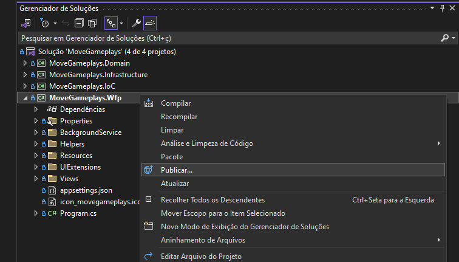

Você pode escolher a pasta em que deseja publicar a aplicação
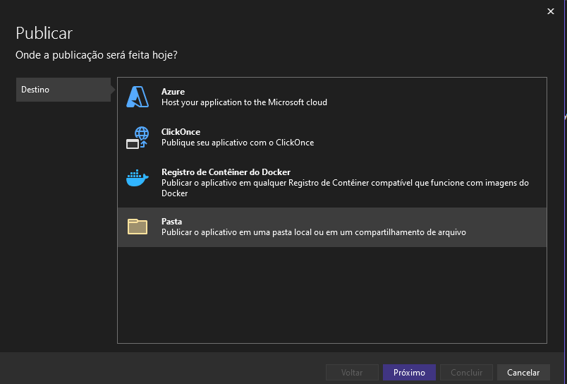

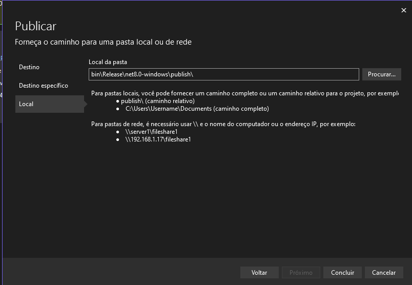

Clique em "Mostrar todas as configurações" e altere de acordo com a imagem abaixo
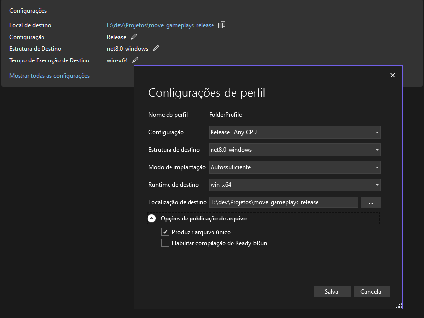

Clique em Publicar
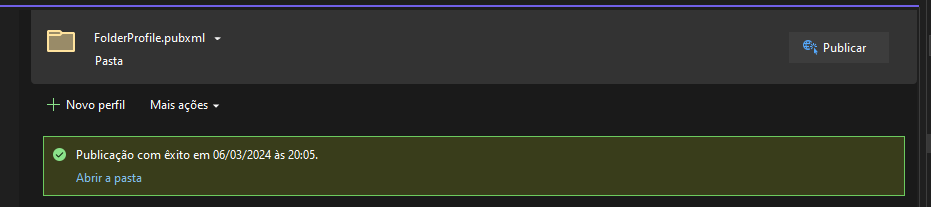

A ideia do projeto é que ao iniciar o windows a aplicação já esteja preparada para aguardar o HD externo ou pen drive ser conectado quando você quiser mover as gameplays.
Para isso, vamos criar um atalho do arquivo .exe gerado na pasta onde a aplicação foi publicada
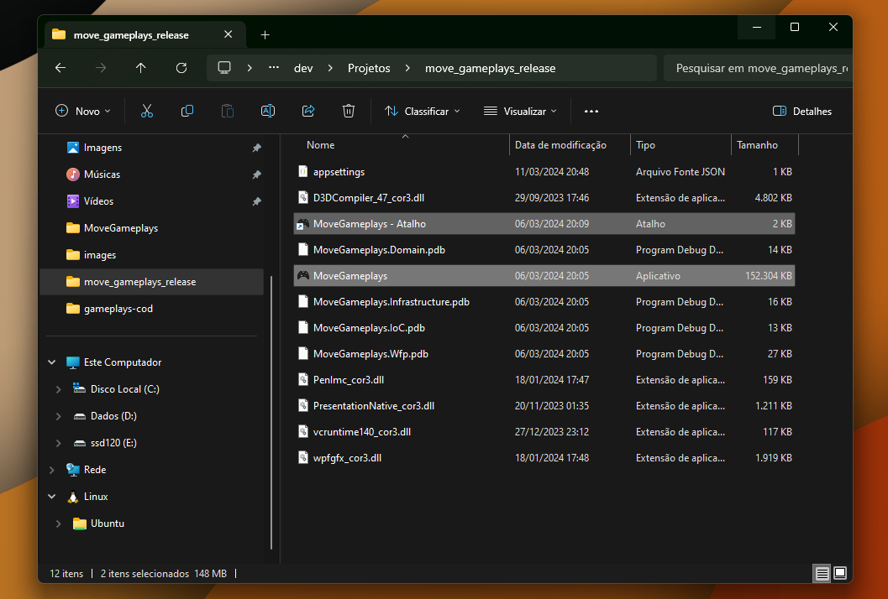

Com o teclado abra o executar utilizando as teclas "Windows + R" e digite:
```
shell:startup
```


Agora basta mover atalho .exe criado na pasta de publicação para a pasta Inicializar do Windows que a aplicação ira iniciar junto dos outros programas de inicialização
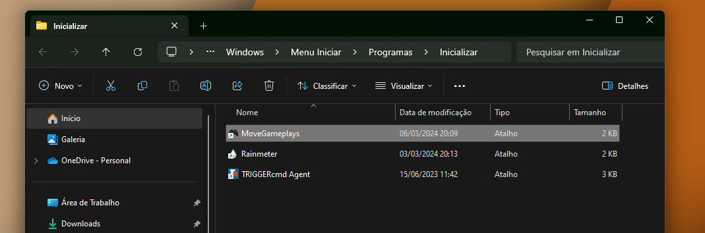


## 💻 Como usar

Ao iniciar a aplicação pela primeira vez, precisamos fazer a configuração inicial, para isso, basta clicar no botão "Configurações" no canto superior direito
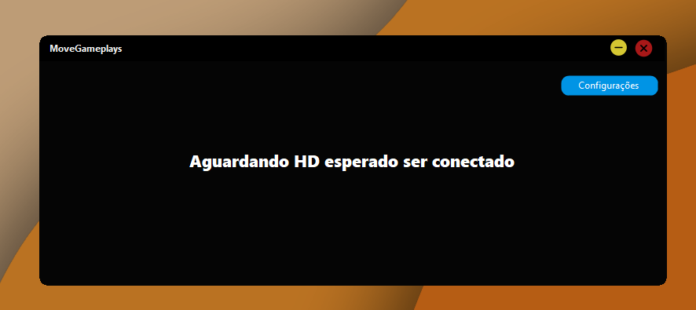

Adicione os campos de acordo com suas configurações, lembrando que não é necessário passar a unidade de disco no campo "Pasta Origem com as Gameplays", a própria aplicação irá detectar a unidade de disco ao observar a entrada de uma novo volume.

O campo "Deletar arquivos" só ira deletar os arquivos após mover todas as imagens e as gameplays escolhidas, caso ocorra algum erro no processo, os arquivos serão mantidos no volume de origem.

Após salvar as alterações a aplicação irá reiniciar e estará pronta para uso
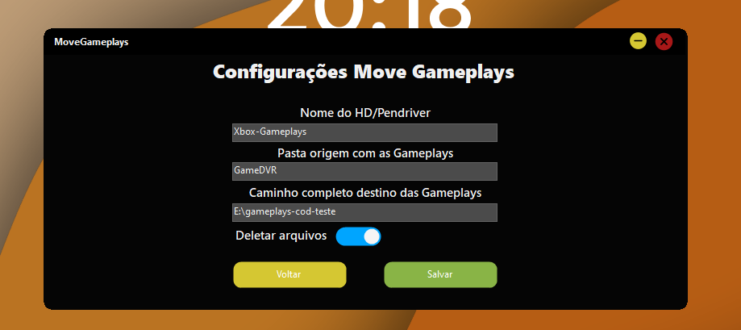

Ao conectar o HD/Pen drive esperado será exibida a tela para que você escolha uma opção e também possa acompanhar o progresso
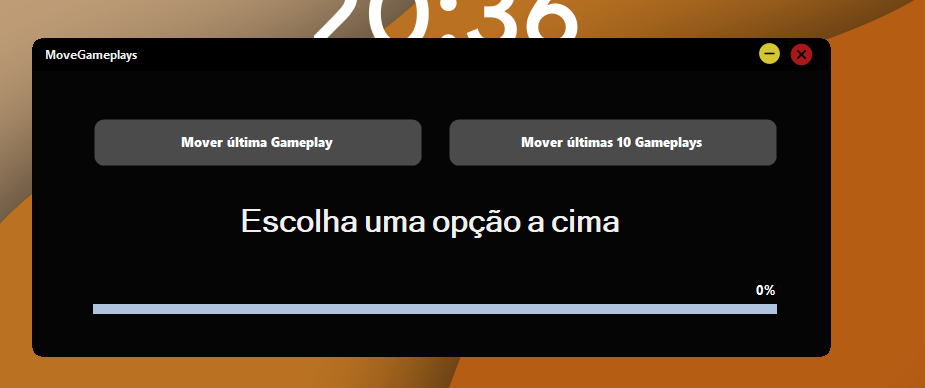
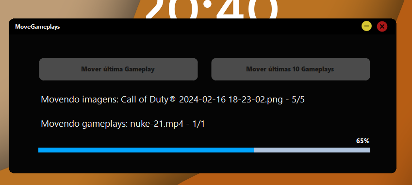
